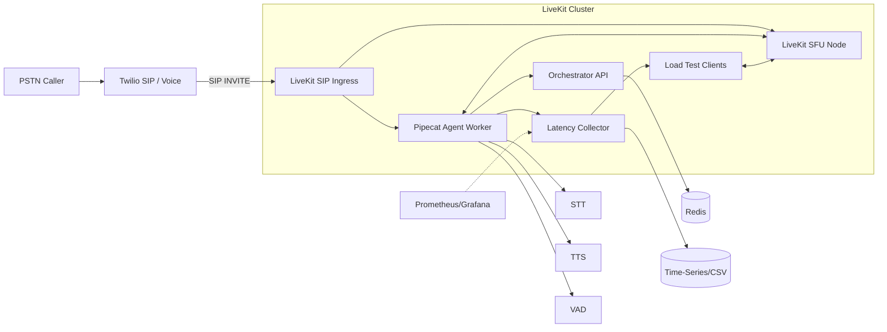

# Telephony -> LiveKit -> Pipecat Minimal Scalable Stack

Goal: Accept 100 concurrent PSTN calls, bridge into LiveKit, drive a Pipecat agent with full‑duplex audio and round‑trip (caller speech start -> agent audio playback) < 600 ms avg.

## High-Level Architecture



## Components

1. LiveKit SFU + SIP Ingress  
   - Handles RTP/SIP from Twilio trunk.
   - Opus 16 kHz mono, min playout delay, reduced jitter buffer.
2. Orchestrator (FastAPI)  
   - Issues LiveKit access tokens for agent & load test clients.  
   - Manages room naming, admission control, health.  
3. Pipecat Agent Worker  
   - Joins room as participant.  
   - Streams audio both directions.  
   - Pipeline: VAD (frame 20ms) -> STT (streaming) -> Simple logic (echo / scripted) -> TTS (streaming) -> LiveKit publish.  
   - Supports barge-in by: if new user speech detected while TTS playing, immediately cancel current TTS task & flush audio track.  
4. Latency Instrumentation  
   - Timestamps:  
     a. SpeechStart: first audio frame crossing VAD threshold.  
     b. STTPartial: first partial transcript (optional).  
     c. AgentDecision: logic produced reply text.  
     d. TTSFirstByte: first audio sample of synthesized speech ready.  
     e. PlaybackStart: first outbound audio frame acknowledged by LiveKit (publish callback).  
     f. RemotePlayout (optional): load test client notes arrival timestamp.  
   - RoundTrip = PlaybackStart - SpeechStart (or RemotePlayout - SpeechStart if measured at client ear).  
5. Metrics Collector  
   - Receives structured JSON over UDP or HTTP; aggregates avg, p50, p95, p99; writes CSV + rolling window summary.  
6. Load Test Harness  
   - Simulates 100 callers: each creates a room (or uses a shared multi-participant room strategy), injects prerecorded prompt bursts (5s speech), listens for agent reply, records latency.  
   - Uses LiveKit WebRTC (python client) to approximate PSTN audio path minus Twilio SIP overhead.  
   - Optional: Twilio Voice Media Streams for more realistic ingest (phase 2).  
7. Twilio Integration  
   - SIP Trunk -> LiveKit SIP Ingress (configure termination URI).  
   - TwiML for inbound number to `<Dial><Sip>sip:room-{{CallSid}}@sip.<YOUR_INGRESS_HOST>?token={{JWT}}</Sip></Dial>` (JWT minted by Orchestrator via Voice webhook).  

## Scaling Strategy (100 Concurrent Calls)

- LiveKit Node: 100 mono audio-only participants well within a single small instance (e.g., c6i.large) but design for horizontal: autoscale additional nodes; LiveKit built-in region-aware room assignment.  
- Agent Workers: 1 lightweight Pipecat worker can handle ~N concurrent sessions (depends on STT/TTS latency). Allocate 1 worker per 25 calls (4 workers) for headroom.  
- STT/TTS: Choose low-latency streaming APIs (e.g., Deepgram/AssemblyAI for STT; ElevenLabs/Cartesia/Edge TTS for TTS). Ensure <150 ms STT first partial, <150 ms TTS first chunk.  
- Redis (or in-memory) for session registry: call_id -> room_name -> agent_worker assignment.  
- Kubernetes (optional): HPA on CPU+custom latency metric; Pod anti-affinity for worker spread.

## Latency Optimization Techniques

| Stage | Target | Technique |
|-------|--------|-----------|
| Capture (PSTN->SIP) | <120 ms | Twilio region nearest caller; SIP over UDP |
| Jitter/Buffer | <60 ms | LiveKit playout min, disable excessive jitter |
| STT First Partial | <150 ms | Enable partial results, 20 ms frames |
| Agent Decision | <30 ms | Simple logic (echo + suffix) |
| TTS First Audio | <150 ms | Streaming TTS; begin playback on first chunk |
| Publish -> Peer | <60 ms | SFU optimized Opus 16k, packetization 20 ms |
| Total | <570 ms | Sum with overlap (pipeline) |

Pipeline overlaps STT with capture; TTS starts while remainder of transcript may still finalize.

## Barge-In Handling

- Maintain current TTS task handle; when VAD SpeechStart detected and state == Speaking, cancel TTS stream and stop publishing track mid-buffer.  
- Optionally play short chime to indicate interruption (disabled for latency).  

## Repository Structure (planned)

```
config/livekit.yaml
orchestrator/app.py
agent/worker.py
agent/pipeline/stt.py
agent/pipeline/tts.py
agent/pipeline/vad.py
metrics/latency_collector.py
loadtest/load_test.py
scripts/generate_tokens.py
docker-compose.yml
k8s/ (optional manifests)
.env.example
README.md
architecture.md (if needed for extended notes)
```

## Environment Variables (.env.example will contain)
- LIVEKIT_API_KEY
- LIVEKIT_API_SECRET
- LIVEKIT_HOST
- ORCH_LISTEN=:8000
- STT_PROVIDER=deepgram
- STT_API_KEY=
- TTS_PROVIDER=elevenlabs
- TTS_API_KEY=
- REDIS_URL=redis://redis:6379/0
- METRICS_ENDPOINT=http://metrics:9100/ingest
- LOG_LEVEL=INFO

## Docker Compose (planned services)

- livekit (official image)  
- orchestrator (FastAPI + uvicorn)  
- agent (worker autoscaled via replicas parameter or separate compose override)  
- metrics (python collector)  
- redis (session registry)  
- loadtest (one-shot container for simulations)  

## Twilio SIP Setup

Detailed steps to bridge PSTN -> LiveKit SIP Ingress:

1. Create a SIP Domain (Voice > SIP Domains) OR Elastic SIP Trunk (if you need outbound too).  
2. Configure SIP Domain Voice Configuration:  
   - Voice Configuration -> SIP URI: `yourdomain.sip.twilio.com`  
   - Request URL (Voice Webhook): `https://YOUR_ORCH_PUBLIC_URL/twilio/voice` (POST).  
   - Fallback URL optional.  
3. Authentication: Prefer IP ACL (add your LiveKit ingress public IPs) or Credential Lists. Keep latency low by avoiding auth challenges when possible (IP allowlist).  
4. (Elastic SIP Trunk path) Under Termination set your Termination SIP URI and map to LiveKit SIP ingress FQDN via DNS SRV if needed.  
5. LiveKit SIP Ingress Host: Point `TWILIO_SIP_INGRESS_HOST` env var to DNS that resolves to your LiveKit server (public). Ensure UDP 5060 and RTP range open.  
6. Inbound Call Flow: PSTN Caller -> Twilio Number -> Twilio invokes Orchestrator webhook -> Orchestrator returns TwiML with `<Dial><Sip>...token=JWT</Sip></Dial>` -> Twilio establishes SIP INVITE to LiveKit with query param token -> LiveKit authenticates & joins room.  
7. Codec: Force Opus if possible (Twilio+SIP) to avoid transcoding (configure LiveKit SIP ingress codecs list, already set to opus). Fallback: PCMU/PCMA increases latency & quality loss.  
8. DTMF / Control (optional): Use LiveKit DataChannel for future features.  
9. Media Streams Alternative: (Phase 2) Twilio Voice Media Streams -> Orchestrator WebSocket -> Publish into LiveKit for scenarios needing custom preprocessing; skip SIP overhead (slightly different path, optional).  

Sample TwiML (Orchestrator response):
```xml
<Response>
  <Dial>
    <Sip>sip:room-{{CALL_SID}}@sip.${LIVEKIT_INGRESS}?token={{JWT}}</Sip>
  </Dial>
</Response>
```

Operational Notes:
- Token TTL kept at 60s; Orchestrator can refresh mid-call if longer sessions required (issue second token & renegotiate).  
- Barge-In Reliability: ensure Twilio sends low-jitter RTP by selecting closest region (use Twilio Voice Media Region parameter on incoming number if applicable).  
- Scaling Beyond 100: Multiple LiveKit SIP ingress endpoints fronted by DNS round robin; Orchestrator chooses region-specific host in TwiML.  

## Performance Optimization Details

Category | Action | Rationale | Target Impact
---------|--------|-----------|--------------
Codec | Opus mono 16k, 20ms ptime | Lower bandwidth + good quality; smaller jitter buffer | -15–30ms vs 40ms ptime
Jitter Buffer | Min 20ms / Max 60ms | Reduces playout delay while tolerating minor network variance | -40ms tail latency
STT | Streaming partials, 20ms frame push | Early partial enables speculative agent logic | First partial <150ms
TTS | Low-latency streaming (start playback on first chunk) | Overlap synthesis & playback | First audio <150ms
Barge-In | Cancel current TTS immediately on VAD start | Avoid waiting full response; faster turn-taking | Reduces perceived RT by 100–400ms
Network | Region pinning (caller -> nearest Twilio POP -> nearest LiveKit region) | Shortens RTT path | -30–80ms
Threading/Async | Single async event loop per worker, avoid blocking | Deterministic scheduling | Jitter reduction
Batch Avoidance | Send raw 20ms frames (no >60ms buffers) | Keeps pipeline shallow | -20–40ms
Metrics | Per-turn structured events, window stats | Continuous feedback to tune thresholds | Sustained SLA <600ms

Proposed Enhancements (future):
- Adaptive VAD hangover (e.g., 200ms) to avoid premature segment splits.
- STT partial gating: start TTS on confidence threshold instead of final.
- TTS truncation on barge-in with fade-out frame to remove click.

## Load Test Approach

- For speed in local/demo: run 100 simulated participants via `loadtest/load_test.py`.  
- Options: `--concurrency 100 --burst-seconds 8 --phrase "test phrase"`  
- Each client: join room, play wave/opus frames (pre-encoded) at real-time pace, record timestamps, await agent response start (first audio frame).  
- Collect latencies -> metrics aggregator -> produce CSV + summary + optional matplotlib plot.  

## Latency Reporting

`metrics/latency_collector.py` exposes `/summary` JSON: 
```
{
  "window_sec":60,
  "count":1000,
  "avg_ms":420,
  "p50_ms":410,
  "p95_ms":560,
  "p99_ms":610
}
```
Graph generation script (optional) will produce PNG.

## Kubernetes (Bonus)

- livekit StatefulSet + Service (NodePort/Ingress)  
- orchestrator Deployment + HPA  
- agent Deployment (scale horizontally)  
- metrics Deployment  
- redis (bitnami/redis)  
- ConfigMaps for livekit.yaml  
- Secrets for API keys  
- PodDisruptionBudgets for livekit & agent  

## Minimal Agent Logic

Pseudo:
```python
on_partial_transcript(text):
    if first_partial and not responding:
        # Wait small debounce or trigger immediate
on_final_transcript(text):
    reply = f"You said: {text}. Nice!"
    start_tts_stream(reply)
```

## Reproduction Steps (Planned)

1. `cp .env.example .env` fill keys.  
2. `docker compose up --build`  
3. (Optional) Configure Twilio & call number.  
4. Run load test: `docker compose run --rm loadtest python load_test.py --concurrency 50` (repeat scaling to 100).  
5. View metrics: `curl localhost:9100/summary`  

## Roadmap (Next Implementation Steps)

1. Commit config/livekit.yaml (baseline).  
2. Implement orchestrator (token issuance, Twilio webhook).  
3. Implement agent worker pipeline modules.  
4. Implement latency collector + schema.  
5. Implement load test script.  
6. Add docker-compose + .env.example.  
7. Add K8s manifests & comparison doc.  
8. Final polish, generate sample latency results.

## Comparison: Docker Compose vs K8s (Summary)

- Compose: fast local, manual scaling (`--scale agent=4`).  
- K8s: autoscaling on CPU & custom latency metrics, easier rolling upgrades, cluster-level observation.  

## Security & Production Notes

- JWT tokens short-lived (60s) for ingress participants.  
- mTLS or ingress-level TLS termination.  
- Rate limiting orchestrator endpoints.  
- Observability: structured JSON logs; metrics exporter (Prometheus).  

## License

MIT (add LICENSE if required).

---

(Implementation files will follow.)
