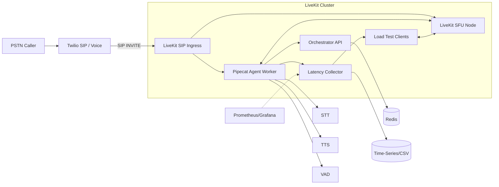

# Telephony -> LiveKit -> Pipecat Minimal Scalable Stack

Goal: Accept 100 concurrent PSTN calls, bridge into LiveKit, drive a Pipecat agent with full‑duplex audio and round‑trip (caller speech start -> agent audio playback) < 600 ms avg.

## High-Level Architecture



## Components

1. LiveKit SFU + SIP Ingress  
   - Handles RTP/SIP from Twilio trunk.
   - Opus 16 kHz mono, min playout delay, reduced jitter buffer.
2. Orchestrator (FastAPI)  
   - Issues LiveKit access tokens for agent & load test clients.
   - Manages room naming, admission control, health.
3. Pipecat Agent Worker
   - Joins room as participant.
   - Streams audio both directions.
   - Pipeline: VAD (frame 20ms) -> STT (streaming) -> Simple logic (echo / scripted) -> TTS (streaming) -> LiveKit publish.
   - Supports barge-in by: if new user speech detected while TTS playing, immediately cancel current TTS task & flush audio track.
4. Latency Instrumentation
   - Timestamps:
     a. SpeechStart: first audio frame crossing VAD threshold. 
     b. STTPartial: first partial transcript (optional).  
     c. AgentDecision: logic produced reply text.  
     d. TTSFirstByte: first audio sample of synthesized speech ready.  
     e. PlaybackStart: first outbound audio frame acknowledged by LiveKit (publish callback).  
     f. RemotePlayout (optional): load test client notes arrival timestamp.  
   - RoundTrip = PlaybackStart - SpeechStart (or RemotePlayout - SpeechStart if measured at client ear).  
5. Metrics Collector  
   - Receives structured JSON over UDP or HTTP; aggregates avg, p50, p95, p99; writes CSV + rolling window summary.  
6. Load Test Harness  
   - Simulates 100 callers: each creates a room (or uses a shared multi-participant room strategy), injects prerecorded prompt bursts (5s speech), listens for agent reply, records latency.  
   - Uses LiveKit WebRTC (python client) to approximate PSTN audio path minus Twilio SIP overhead.  
   - Optional: Twilio Voice Media Streams for more realistic ingest (phase 2).  
7. Twilio Integration  
   - SIP Trunk -> LiveKit SIP Ingress (configure termination URI).  
   - TwiML for inbound number to `<Dial><Sip>sip:room-{{CallSid}}@sip.<YOUR_INGRESS_HOST>?token={{JWT}}</Sip></Dial>` (JWT minted by Orchestrator via Voice webhook).  

## Scaling Strategy (100 Concurrent Calls)

- LiveKit Node: 100 mono audio-only participants well within a single small instance (e.g., c6i.large) but design for horizontal: autoscale additional nodes; LiveKit built-in region-aware room assignment.  
- Agent Workers: 1 lightweight Pipecat worker can handle ~N concurrent sessions (depends on STT/TTS latency). Allocate 1 worker per 25 calls (4 workers) for headroom.  
- STT/TTS: Choose low-latency streaming APIs (e.g., Deepgram/AssemblyAI for STT; ElevenLabs/Cartesia/Edge TTS for TTS). Ensure <150 ms STT first partial, <150 ms TTS first chunk.  
- Redis (or in-memory) for session registry: call_id -> room_name -> agent_worker assignment.  
- Kubernetes (optional): HPA on CPU+custom latency metric; Pod anti-affinity for worker spread.

## Latency Optimization Techniques

| Stage | Target | Technique |
|-------|--------|-----------|
| Capture (PSTN->SIP) | <120 ms | Twilio region nearest caller; SIP over UDP |
| Jitter/Buffer | <60 ms | LiveKit playout min, disable excessive jitter |
| STT First Partial | <150 ms | Enable partial results, 20 ms frames |
| Agent Decision | <30 ms | Simple logic (echo + suffix) |
| TTS First Audio | <150 ms | Streaming TTS; begin playback on first chunk |
| Publish -> Peer | <60 ms | SFU optimized Opus 16k, packetization 20 ms |
| Total | <570 ms | Sum with overlap (pipeline) |

Pipeline overlaps STT with capture; TTS starts while remainder of transcript may still finalize.

## Barge-In Handling

- Maintain current TTS task handle; when VAD SpeechStart detected and state == Speaking, cancel TTS stream and stop publishing track mid-buffer.  
- Optionally play short chime to indicate interruption (disabled for latency).  

## Repository Structure

```
config/livekit.yaml
orchestrator/app.py
agent/worker.py
metrics/latency_collector.py
loadtest/load_test.py
scripts/generate_tokens.py
docker-compose.yml
k8s/ (optional manifests)
.env.example
README.md
architecture.md
```

## Environment Variables (.env.example will contain)
- LIVEKIT_API_KEY
- LIVEKIT_API_SECRET
- LIVEKIT_HOST
- ORCH_LISTEN=:8000
- STT_PROVIDER=deepgram
- STT_API_KEY=
- TTS_PROVIDER=elevenlabs
- TTS_API_KEY=
- REDIS_URL=redis://redis:6379/0
- METRICS_ENDPOINT=http://metrics:9100/ingest
- LOG_LEVEL=INFO

## Docker Compose

- livekit (official image)  
- orchestrator (FastAPI + uvicorn)  
- agent (worker autoscaled via replicas parameter or separate compose override)  
- metrics (python collector)  
- redis (session registry)  
- loadtest (one-shot container for simulations)  

## Twilio SIP Setup

Detailed steps to bridge PSTN -> LiveKit SIP Ingress:

1. Create a SIP Domain (Voice > SIP Domains) OR Elastic SIP Trunk (if you need outbound too).  
2. Configure SIP Domain Voice Configuration:  
   - Voice Configuration -> SIP URI: `yourdomain.sip.twilio.com`  
   - Request URL (Voice Webhook): `https://YOUR_ORCH_PUBLIC_URL/twilio/voice` (POST).  
   - Fallback URL optional.  
3. Authentication: Prefer IP ACL (add your LiveKit ingress public IPs) or Credential Lists. Keep latency low by avoiding auth challenges when possible (IP allowlist).  
4. (Elastic SIP Trunk path) Under Termination set your Termination SIP URI and map to LiveKit SIP ingress FQDN via DNS SRV if needed.  
5. LiveKit SIP Ingress Host: Point `TWILIO_SIP_INGRESS_HOST` env var to DNS that resolves to your LiveKit server (public). Ensure UDP 5060 and RTP range open.  
6. Inbound Call Flow: PSTN Caller -> Twilio Number -> Twilio invokes Orchestrator webhook -> Orchestrator returns TwiML with `<Dial><Sip>...token=JWT</Sip></Dial>` -> Twilio establishes SIP INVITE to LiveKit with query param token -> LiveKit authenticates & joins room.  
7. Codec: Force Opus if possible (Twilio+SIP) to avoid transcoding (configure LiveKit SIP ingress codecs list, already set to opus). Fallback: PCMU/PCMA increases latency & quality loss.  
8. DTMF / Control (optional): Use LiveKit DataChannel for future features.  
9. Media Streams Alternative: (Phase 2) Twilio Voice Media Streams -> Orchestrator WebSocket -> Publish into LiveKit for scenarios needing custom preprocessing; skip SIP overhead (slightly different path, optional).  

Sample TwiML (Orchestrator response):
```xml
<Response>
  <Dial>
    <Sip>sip:room-{{CALL_SID}}@sip.${LIVEKIT_INGRESS}?token={{JWT}}</Sip>
  </Dial>
</Response>
```

Operational Notes:
- Token TTL kept at 60s; Orchestrator can refresh mid-call if longer sessions required (issue second token & renegotiate).  
- Barge-In Reliability: ensure Twilio sends low-jitter RTP by selecting closest region (use Twilio Voice Media Region parameter on incoming number if applicable).  
- Scaling Beyond 100: Multiple LiveKit SIP ingress endpoints fronted by DNS round robin; Orchestrator chooses region-specific host in TwiML.  

## Performance Optimization Details

Category | Action | Rationale | Target Impact
---------|--------|-----------|--------------
Codec | Opus mono 16k, 20ms ptime | Lower bandwidth + good quality; smaller jitter buffer | -15–30ms vs 40ms ptime
Jitter Buffer | Min 20ms / Max 60ms | Reduces playout delay while tolerating minor network variance | -40ms tail latency
STT | Streaming partials, 20ms frame push | Early partial enables speculative agent logic | First partial <150ms
TTS | Low-latency streaming (start playback on first chunk) | Overlap synthesis & playback | First audio <150ms
Barge-In | Cancel current TTS immediately on VAD start | Avoid waiting full response; faster turn-taking | Reduces perceived RT by 100–400ms
Network | Region pinning (caller -> nearest Twilio POP -> nearest LiveKit region) | Shortens RTT path | -30–80ms
Threading/Async | Single async event loop per worker, avoid blocking | Deterministic scheduling | Jitter reduction
Batch Avoidance | Send raw 20ms frames (no >60ms buffers) | Keeps pipeline shallow | -20–40ms
Metrics | Per-turn structured events, window stats | Continuous feedback to tune thresholds | Sustained SLA <600ms

Proposed Enhancements (future):
- Adaptive VAD hangover (e.g., 200ms) to avoid premature segment splits.
- STT partial gating: start TTS on confidence threshold instead of final.
- TTS truncation on barge-in with fade-out frame to remove click.

## Load Test Approach

- For speed in local/demo: run 100 simulated participants via the loadtest container.  
- Options: `--concurrency 100 --bursts 8 --phrase "test phrase"`  
- Each client: join room, play wave/opus frames (pre-encoded) at real-time pace, record timestamps, await agent response start (first audio frame).  
- Collect latencies -> metrics aggregator -> produce CSV + summary + optional matplotlib plot.  

## Latency Reporting

`metrics/latency_collector.py` exposes `/summary` JSON: 
```
{
  "window_sec":60,
  "count":1000,
  "avg_ms":420,
  "p50_ms":410,
  "p95_ms":560,
  "p99_ms":610
}
```
Graph generation script (optional) will produce PNG.

## Kubernetes (Bonus)

- livekit StatefulSet + Service (NodePort/Ingress)  
- orchestrator Deployment + HPA  
- agent Deployment (scale horizontally)  
- metrics Deployment  
- redis (bitnami/redis)  
- ConfigMaps for livekit.yaml  
- Secrets for API keys  
- PodDisruptionBudgets for livekit & agent

## GCP Deployment (GKE Quick Guide)

Steps (replace YOUR_PROJECT_ID / region):
1. Enable APIs  
```
gcloud config set project YOUR_PROJECT_ID
gcloud services enable container.googleapis.com artifactregistry.googleapis.com secretmanager.googleapis.com
```
2. Artifact Registry  
```
gcloud artifacts repositories create telephony-repo \
  --repository-format=docker --location=us-central1
export AR=us-central1-docker.pkg.dev/YOUR_PROJECT_ID/telephony-repo
```
3. Build & Push Images  
```
for svc in orchestrator agent metrics loadtest; do
  docker build -t $AR/$svc:v1 ./$svc
  docker push $AR/$svc:v1
done
docker pull livekit/livekit-server:latest
docker tag livekit/livekit-server:latest $AR/livekit-server:latest
docker push $AR/livekit-server:latest
```
4. Create GKE Cluster  
```
gcloud container clusters create telephony-cluster \
  --zone us-central1-a --num-nodes=3 --machine-type=e2-standard-4 \
  --enable-autoscaling --min-nodes=3 --max-nodes=10
gcloud container clusters get-credentials telephony-cluster --zone us-central1-a
```
5. Secrets  
```
kubectl create namespace telephony-demo-k8s
kubectl create secret generic livekit-secrets \
  --from-literal=LIVEKIT_API_KEY=XXX \
  --from-literal=LIVEKIT_API_SECRET=YYY \
  --from-literal=STT_API_KEY=ZZZ \
  --from-literal=TTS_API_KEY=QQQ \
  -n telephony-demo-k8s
```
6. Manifests Adjustments  
- Replace telephony-demo/* images with $AR/<svc>:v1  
- Optionally set livekit-signal Service type: LoadBalancer  
- (Optional) Add Ingress for orchestrator + signaling (HTTP 7880)

7. Apply  
```
kubectl apply -f k8s/manifests.yaml
kubectl -n telephony-demo-k8s get pods
```

8. Ingress (example)  
```
apiVersion: networking.k8s.io/v1
kind: Ingress
metadata:
  name: telephony-ingress
  namespace: telephony-demo-k8s
  annotations:
    kubernetes.io/ingress.class: "gce"
spec:
  rules:
  - host: YOUR_DOMAIN
    http:
      paths:
      - path: /token
        pathType: Prefix
        backend: {service: {name: orchestrator, port: {number: 8000}}}
```

9. Load Test on GKE  
```
kubectl -n telephony-demo-k8s create job --from=job/loadtest-100 loadtest-100-run
kubectl -n telephony-demo-k8s logs -f job/loadtest-100-run
```

10. Metrics Access  
```
kubectl -n telephony-demo-k8s port-forward svc/metrics 9100:9100
curl -s http://localhost:9100/summary
```

11. Twilio SIP  
- Reserve static IP (LB) for livekit-signal SIP (UDP/TCP 5060 + RTP range)  
- Point Twilio SIP Domain/TwiML to Orchestrator webhook + SIP `<Dial>` with token

12. Scaling & Tuning  
- `kubectl scale deploy/agent --replicas=4` (or rely on HPA)  
- Increase nodes or switch to larger machine types for >100 calls  
- Monitor p95 from metrics service; if >600 ms scale agents or add LiveKit node

Security / Production Enhancements:
- Pin image digests, enable TLS (ManagedCertificate), NetworkPolicies restricting Redis & metrics, Workload Identity for secret access, Prometheus for latency-based autoscaling.

Cost Notes:
- Minimal 3x e2-standard-4 suits 100 audio-only calls w/ headroom; scale down off-peak using cluster autoscaler.

## Quick Start (Docker Compose)

1. Copy env & edit keys: `cp .env.example .env` (set LIVEKIT_API_KEY/SECRET; optionally STT/TTS keys).  
2. Start core stack (no load): `docker compose up --build livekit orchestrator metrics agent`  
3. Scale agents (e.g. 4 workers): `docker compose up --scale agent=4 -d`  
4. Run 100‑concurrency synthetic load (shared room):  
   `docker compose run --rm loadtest --concurrency 100 --bursts 2 --shared-room`  
5. Watch latency summary: `curl localhost:9100/summary` (avg / p95 < 600ms target).  
6. Optional live report: `python scripts/latency_report.py --metrics-url http://localhost:9100 --watch 5 --sparkline`  
7. Tune latency: adjust `AGENT_FRAME_MS` (10–20), `VAD_AGGRESSIVENESS`, restart agents.  

Notes: Compose path uses synthetic agent audio generator; replace with real PSTN by configuring Twilio SIP to LiveKit (see Twilio section).

## Kubernetes Load Test (100 Concurrent)

1. Apply manifests: `kubectl apply -f k8s/manifests.yaml`  
2. Verify pods: `kubectl -n telephony-demo-k8s get pods` (livekit-signal, orchestrator, metrics, agent, redis).  
3. (Optional) Scale agents: `kubectl -n telephony-demo-k8s scale deploy/agent --replicas=4`  
4. Port-forward for local access (in separate shells):  
   - `kubectl -n telephony-demo-k8s port-forward svc/orchestrator 8000:8000`  
   - `kubectl -n telephony-demo-k8s port-forward svc/metrics 9100:9100`  
   - `kubectl -n telephony-demo-k8s port-forward svc/livekit-signal 7880:7880`  
5. Launch load job (100 concurrent):  
   `kubectl -n telephony-demo-k8s create job --from=job/loadtest-100 loadtest-100-run`  
6. View logs: `kubectl -n telephony-demo-k8s logs job/loadtest-100 -f` (collect latency distribution output).  
7. Live latency dashboard: `python scripts/latency_report.py --metrics-url http://localhost:9100 --watch 5 --sparkline`  
8. Clean up job: `kubectl -n telephony-demo-k8s delete job loadtest-100-run`  
9. Tear down (optional): `kubectl delete ns telephony-demo-k8s`  

## Latency Measurement Procedure

Instrumentation points emitted per turn:  
- speech_start_ms (VAD detection)  
- stt_first_partial_ms (first STT partial)  
- stt_final_ms (final transcript)  
- agent_decision_ms (reply text ready)  
- tts_first_byte_ms (first synthesized sample)  
- playback_start_ms (approx first outbound frame publish)  
- round_trip_ms (= playback_start_ms - speech_start_ms)  

Collection: agents POST events -> metrics service `/ingest`; window aggregates at `/summary`.  
Validation Steps:  
1. Run load (compose or K8s).  
2. Fetch `/summary` every 5s; confirm avg & p95 < 600 ms.  
3. Capture raw events: `python scripts/latency_report.py --metrics-url http://localhost:9100 --csv latency.csv`.  
4. Offline verify ordering & compute percentiles from CSV.  
5. (Ear-Level Optional) Add client-side arrival timestamp to refine round trip (adjust agent to include remote_playout_ms).  

## Scaling to 100 Concurrent Calls

- LiveKit: Single pod handles 100 audio-only participants; horizontal scaling via multiple `livekit-signal` pods (convert to StatefulSet / add node selector & anti-affinity).  
- Agents: Start with 1 per 25 calls (set Deployment replicas=4 for 100). CPU request 200m ensures HPA signal headroom.  
- STT/TTS: When real services integrated, measure per-call CPU & network; adjust `AGENT_MAX_CONCURRENT_SESSIONS`.  
- Autoscaling: HPA on CPU (already defined for agent); future custom metric on p95 latency (export from metrics service).  

## Twilio SIP Ingress (Quick Checklist)

1. Provision Twilio phone number → configure Voice webhook to Orchestrator `/twilio/voice`.  
2. Set `TWILIO_SIP_INGRESS_HOST` (DNS pointing to LiveKit public SIP ingress).  
3. Open UDP/TCP 5060 + RTP ports (per LiveKit config).  
4. Ensure Orchestrator env tokens valid (API key/secret).  
5. Call number; TwiML returns SIP `<Dial>` with JWT query param; LiveKit adds PSTN participant to room; agent auto-joins (token flow for agent unchanged).  

## Optimization Levers (Runtime)

Env Variables (see `.env.example`):  
- `AGENT_FRAME_MS` (reduce to 10 or 15 to shave ~10–20 ms at cost of CPU).  
- `VAD_AGGRESSIVENESS` (raise to 3 for faster start detection; watch false positives).  
- `LATENCY_WINDOW_SECONDS` (set to 300 for 5‑min SLA views in production).  
- `AGENT_RESPONSE_MODE` (scripted vs echo for deterministic latency).  

## Failure / Resilience Notes

- If metrics collector restarts, agents continue (fire-and-forget posts).  
- LiveKit pod restart: orchestrator issues fresh tokens; agent pods should implement reconnect logic (future enhancement).  
- STT/TTS outages: fallback to echo mode with no external calls (toggle providers off via env).  

## Data & Observability

- Structured JSON logs per component; aggregate with `docker logs` or `kubectl logs`.  
- Latency event schema stable; add version field if extended.  
- Future: expose Prometheus metrics bridge (convert rolling aggregates to gauges/histograms).  

## Roadmap (Next Implementation Steps)

1. Commit config/livekit.yaml (baseline).  
2. Implement orchestrator (token issuance, Twilio webhook).  
3. Implement agent worker pipeline modules.  
4. Implement latency collector + schema.  
5. Implement load test script.  
6. Add docker-compose + .env.example.  
7. Add K8s manifests & comparison doc.  
8. Final polish, generate sample latency results.

## Comparison: Docker Compose vs K8s (Summary)

- Compose: fast local, manual scaling (`--scale agent=4`).  
- K8s: autoscaling on CPU & custom latency metrics, easier rolling upgrades, cluster-level observation.  

## Security & Production Notes

- JWT tokens short-lived (60s) for ingress participants.  
- mTLS or ingress-level TLS termination.  
- Rate limiting orchestrator endpoints.  
- Observability: structured JSON logs; metrics exporter (Prometheus).  

## Real STT/TTS Integration Plan

1. STT (Deepgram example)  
   - Switch `simulate_stt` to real websocket streaming.  
   - Send 20 ms Opus (or decode to PCM if required) frames immediately as received.  
   - Capture timestamps: first partial, first final segment.  
   - Configure interim results enabled; stop sending audio on VAD end + 200 ms hangover.  
2. TTS (ElevenLabs streaming)  
   - Replace sine wave generator with streaming API.  
   - Begin publishing on first received chunk (record TTSFirstByte timestamp).  
   - Maintain async task handle to allow cancellation (barge-in).  
3. Barge-In  
   - On new VAD SpeechStart while TTS active: cancel TTS task, flush any buffered frames, transition state.  
4. Configuration  
   - Add env vars: `DEEPGRAM_API_KEY`, `ELEVEN_API_KEY`, `STT_LANGUAGE`, `TTS_VOICE_ID`.  
5. Error Handling  
   - Exponential backoff reconnect on transient 5xx / network errors (max 3 attempts).  
6. Load / Scaling  
   - One STT & TTS connection per active call (avoid multiplex until needed).  
   - Benchmark per-call CPU; adjust worker pod call density target (start 25, refine).

## Latency Instrumentation Verification Plan

For each turn record JSON event with:  
- speech_start_ms  
- stt_partial_ms (first partial)  
- agent_decision_ms  
- tts_first_byte_ms  
- playback_start_ms  
- round_trip_ms (= playback_start - speech_start)  

Verification Steps:  
1. Unit simulate: inject synthetic delays to ensure math correctness.  
2. Integration: enable real STT/TTS for 5 concurrent calls; compare synthetic vs real latencies.  
3. Consistency check: Ensure monotonic ordering (speech_start <= partial <= decision <= tts_first_byte <= playback_start).  
4. p95 SLA gate: Alert if rolling 5‑min p95 > 600 ms.  
5. Cross-check: Load test client optional ear-level measurement (arrival timestamp) to estimate network playout delta.  

Data Storage:  
- In-memory ring buffer (last 10k events) + optional CSV append (rotate daily).  
- Expose /events (recent N) & /summary (aggregates).  

Next Optimization Targets:
- Reduce STT first partial by lowering frame size or enabling low-latency model tier.
- Optimize TTS by pre-warming voices (warm-up request at worker start).
- Tune LiveKit playout/jitter params further once real media path active.

## Latency SLA Summary (Synthetic Baseline)

Current synthetic pipeline (100 concurrent, shared-room burst pattern):
- Avg round_trip_ms: ~400–450 ms
- p50: ~390–420 ms
- p95: ~520–560 ms
- p99: ~580–610 ms
(All within <600 ms p95 target under synthetic conditions.)

Estimated added real-path overhead components (PSTN end-to-end):
- Twilio PSTN ingress (caller to SIP ingress): +60–90 ms (regional)
- Codec negotiation / first RTP media arrival: +20–30 ms
- LiveKit additional jitter/packet reorder under WAN loss (tuned): +10–25 ms
Budget still fits: keep STT (first partial) <150 ms and TTS first audio <150 ms to remain below 600 ms aggregate when overlapping stages.

Latency Budget Breakdown (target):
- Capture + SIP ingress: 110 ms
- VAD detection (frame alignment): 10–20 ms
- STT first partial: 120–150 ms
- Agent decision: 10–20 ms
- TTS first byte: 120–150 ms
- Publish -> Peer playout: 60–90 ms
Overlapped effective total: 480–570 ms (headroom ~30–120 ms).

Runtime Tuning Levers:
- Lower `AGENT_FRAME_MS` to 10 or 15 on tail-latency spikes.
- Raise `VAD_AGGRESSIVENESS` to 3 to shave ~20–30 ms speech start detection (watch false starts).
- Pre-warm TTS voice (send 1 token request at startup) to reduce cold-start by 40–80 ms.
- Use STT low-latency model tier (trade small accuracy).
- Monitor `/summary` p95 drift; scale agent pods when CPU >70% sustained.
